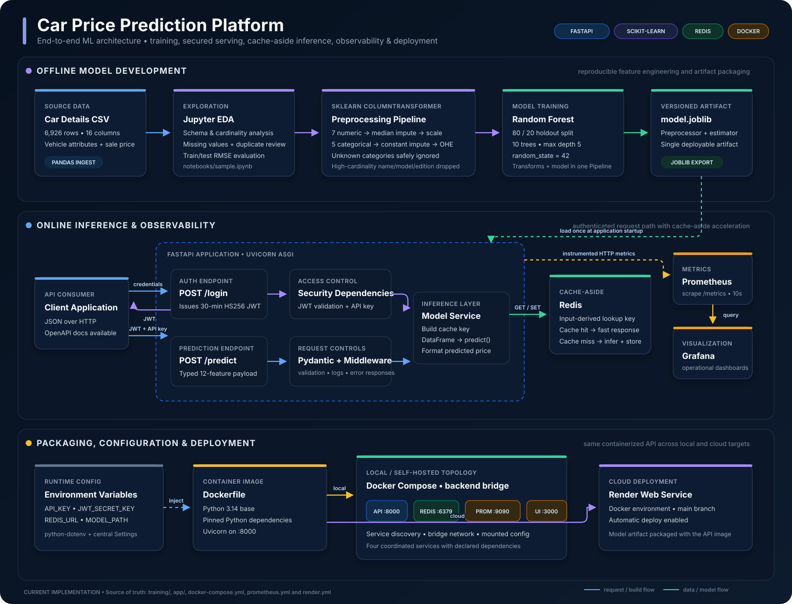

# End-to-End Car Price Prediction Platform

An end-to-end machine learning system that trains a car-price regression model and serves real-time predictions through a secured, observable FastAPI service.

## System architecture

The architecture demonstrates:

- A reproducible scikit-learn training pipeline with numeric/categorical preprocessing, missing-value handling, one-hot encoding, scaling, and a Random Forest regressor.
- A typed FastAPI inference API protected by JWT authentication and an API key, with centralized configuration, middleware logging, and consistent exception handling.
- Cache-aside prediction serving with Redis to avoid repeated model inference for identical feature sets.
- Prometheus HTTP instrumentation and Grafana visualization in a Docker Compose observability stack.
- Containerized Uvicorn serving for local deployment and automatic Docker-based deployment from `main` to Render.

## ML workflow

The project uses 6,926 car records with 12 selected model features. Training removes duplicates and high-cardinality descriptive fields, creates a deterministic 80/20 split, and packages preprocessing and prediction into one deployable `joblib` artifact. The accompanying notebook records a test RMSE of 172,392.131 for the explored model configuration.

## API flow

1. Call `POST /login` to receive a 30-minute HS256 JWT.
2. Send the JWT, configured API key, and a validated 12-feature JSON payload to `POST /predict`.
3. The model service checks Redis, runs the packaged scikit-learn pipeline on a cache miss, stores the result, and returns the formatted predicted price.

FastAPI also exposes interactive OpenAPI documentation at `/docs` and Prometheus metrics at `/metrics`.

## Technology stack

Python 3.14 · FastAPI · Pydantic · scikit-learn · pandas · Redis · JWT · Prometheus · Grafana · Docker Compose · Render
